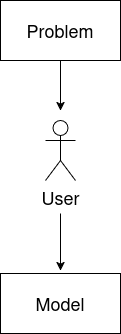
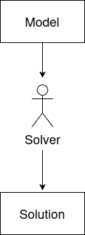
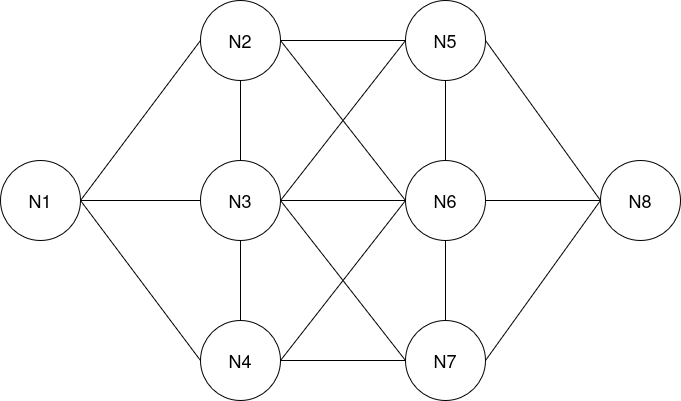
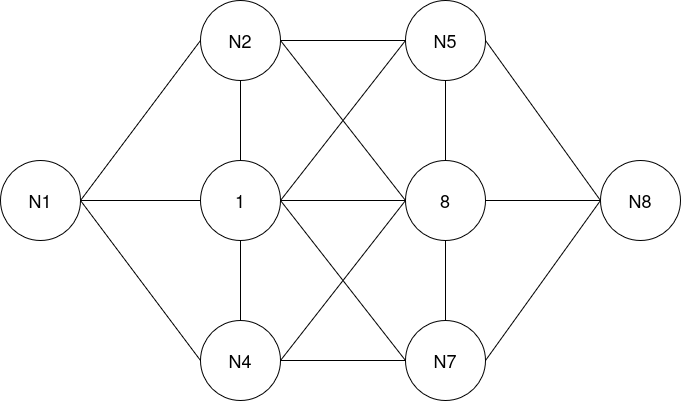
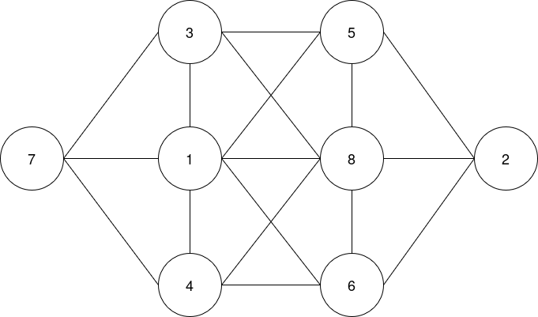

# Introduction
`Why Constraint Programming?`.

## 1. Introduction
**Constraint programming** is an important and growing area of Artificial Intellingence. It is primarly used to address **Combinatorial Optimization Problems**, types of problems where the goal is to find out the optimal solution within a `finite` search space or a `discrete set` of possibilities.

## 2. What is Constraint Programming and why?
**CP** is a declarative programming paradigm designed to solve such problems by identifying the optimal solution from a discrete set of solutions. Solving a Combinatorial Optimization Problem involves several essential steps:
- 1st Define the decision problem specifying:
  - 1.ast `Unknown variables`, also known as **decision variables** ($X_1, ..., X_n$).
  - 1.bst All `possible values` for these variables, simply named **domains** ($D_1, ..., D_n \text{ with each } D_i(X_i) = {v_{i1}, ..., v_{id}}$).
  - 1.cst Potential `relations` among the variables, called **constraints** ($C_1, ..., C_m \text{ with each } C_i(X_i, ..., X_k)$).

    An informal definition about constraints can be described as follows: something that restricts the decision variables $(X_1, ..., X_n)$ or only one of them at the same time. Therefore, in order to find out the optimal solution, we can use this notion for reducing the amount of the search space, making the entire process more efficient. As illustred in the image below, the modelling phase is entirely designed by the user, meaning the responsability for structuring the problem is up to us.

    

        
    
 

- 2 nd Then a **constraint solver** works to discover a potential solution by:
  - 2.and Assigning a value from its domain to each variable, ensuring all the constraints already stated are satisfied simultaneously.
  - 2.bnd Exploring all possible variable-value combinations.

    The last point highlights why we refer to these as **complete problems**: we are guaranteed to be working within a complete set of possible solutions. By the way, this set could be **exponential**, so exhaustively searching would be impossible. Instead, we need a smart strategy to prune the search space whenever we encounter an invalid combination of variables assignments. 

    

        
    
 

In addition, Constraint Programming provides us a rich language for both expressing constraints and defining search procedures, giving us an intuitive **modelling way** and precise control over the search process.

## 3. Orthogonal and Complementary Approaches to Combinatorial Decision Making Optimization (CDMO) Problems
The choice of programming paradigm depends on the **nature** of the problem and the primary **objective**. The most two used paradigms are:
| Aspect | ILP (Integer Linear Programming) | CP (Constraint Programming) |
|:-------|:---------------------------------|:-----------------------------|
| **Origin** | Operational Research (OR) | Artificial Intelligence (AI) |
| **Modelling** | The problem can be expressed with linear inequalities | Rich language for modelling and search strategies |
| **Core technique** | Numerical calculations | Logical processing |
| **Variable handling** | Solve relaxation of the entire problem, using float values for integer variables | Examine subproblems (constraints) reducing the variable domains |
| **Perspective** | Global view on a relaxation of the entire problem | Global view by propagation of domain reductions across constraints |
| **Focus** | **Optimality** of the solution | **Feasibility** of the solution |
| **Search approach** | Search by assigning integers to float values | Search by assigning values to variables from domains |

Both paradigms try always to find out the final solution reducing the search space. However, our focus here is on Constraint Programming paradigm. As the table suggests, CP is very useful when we have to deal with **irregular problems**, such as scheduling allocation, timetabling or sequencing.

Another key aspect that emerges from the previous table is that CP is mainly focused on **feasibility**. In other words, CP seeks an **acceptable** solution rather than the best one.

## 4. Overview of CP
As we already know, the Constraint Programming **Solver** is an engine that finds a possible solution. But, how does it work?

- 1st Since the **Modelling** phase is our responsability, we must define the variables, their domains, and the relationship between them (the constraints). At the same time, the Modelling phase is crucial for the effectiveness of the Solver: larger domains the more complex the search space is.
- 2nd Once the model is defined, the **Search** phase begins. A backtracking tree search algorithm enumerates all possible variable-value combinations to find out a solution.
- 3rd Whenever we discover a bad combination of values we perform a **Constraint Propagation**. Constraint Propagation is an algorithm that examines constraints to reduce variable domains. Furthermore, through Constraint Propagation we are able not only to reduce the search space, but also to find a way that simultaneously satisfies all the stated constraints.
- 4th **Search Heuristic** is critical for the Solver's effectiveness. Generally a heuristic is a search algorithm that uses the current search state to direct the solution of the problem (topic very similar to Local Search, where we basically attempt to guide the search to the most promising areas).

Earlier, we gave an informal definition about constraints as relationships between decision varibles. However, constraints are useful for two key purposes:
- 1st They help break down the problem into managable subproblems, as highlithed in the comparison table.
- 2nd Through propagation, they shrink the search space, which is often exponential.
  
So, how does the Constraint Propagation work in practice? **Search Decisions** (briefly, the values assigned to the decision variables) and **Constraint Propagation** are interleaved: after each assignment, we check whether all the constraints are still satisfied. If so, we proceed with other assignments propagating the effects. Otherwise, we backtrack and attempt a different value.

## 5. A Puzzle
`Place a different number in each node (1 to 8) such that adjacent nodes cannot take consecutive numbers`.

    

 

- **Variables**: each node is represented as a decision variable ($N_1, ..., N_8$).
- **Domains**: each variable ($N_1, ..., N_8$) has the domain {$1, 2, 3, 4, 5, 6, 7, 8$}.
- **Constraints**: there are two types of constraints:
  - 1st $\forall \text{ i < j, } \text{ such that } N_i \text{ and } N_j \text{ are adjacent, } |N_i - N_j| > 1$.
  - 2nd $\forall \text{ i < j, } N_i \ne N_j$.
  
In any problem, the **Solver** typically starts from the hardest assignments. In this case, the hardest ones are the nodes with the higher number of constraints, symbolized by the total amount of connections between them. Therefore, the first assignments will be $N_3$ and $N_6$.

$N_3$ and $N_6$ are assigned the safest values, those that have the lowest probability to conflict with constraints. From the domain, the only such values are $1$ and $8$.

    

 

Now, we evaluate the constraints, reducing domains and propagating the effects. This step is crucial for reducing the search space of the future decision variables.

Given that all the variables must have a distinct value and adjecent node cannot be consecutive, we reduce the domains as follows:
- $N_1 \rightarrow \{3, 4, 5, 6, 7\}$
- $N_2 \rightarrow \{3, 4, 5, 6\}$
- $N_4 \rightarrow \{3, 4, 5, 6\}$
- $N_5 \rightarrow \{3, 4, 5, 6\}$
- $N_7 \rightarrow \{3, 4, 5, 6\}$
- $N_8 \rightarrow \{2, 3, 4, 5, 6\}$

We continue this iterative process as done previously: assigning values, checking constraints and propagating the effects.

    

 

Following this approach, we obtain the final solution without any backtracking activity. Instead, if domain reductions are insufficient, we might encounter scenarios where multiple backtracking steps are required. 

Without a proper **intelligent assignment**, we found ourselves without a solution and performing a total of 45 backtracks.

## 6. Conclusion
For an efficient Constraint Programming solving, the following are essential:
- 1st A robust and effective Constraint Propagation algorithm.
- 1st An efficient and effective search algorithms and heuristics.
- 2nd A well-structured model with carefully defined set of constraints.